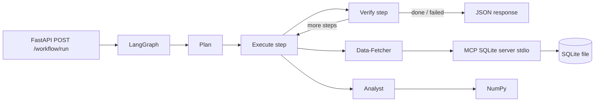

# Agentic Workflow Orchestrator

**A small production-style backend that coordinates AI-style agents the same way serious systems do: with a clear plan, guarded tools, and explicit verification—not a single brittle prompt.**

---

### In one minute

| | |
|--|--|
| **What it is** | A **FastAPI** service that runs a **LangGraph** state machine: a *manager* breaks your goal into steps, a *data agent* pulls rows from a **SQLite** database through the **Model Context Protocol (MCP)**, and an *analyst* runs **NumPy** math on the results. |
| **Why it’s interesting** | Database access is **not** “the LLM runs SQL in your app.” It goes through a **separate MCP server** (stdio) with **read-only** tools and extra **SQL checks**—closer to how you’d isolate permissions in a real product. |
| **What you send** | One JSON `goal` (or an optional explicit `plan_override`). You get back the **plan**, **artifacts** (rows + stats), and **verification notes**. |

**Stack:** Python 3.11+ · FastAPI · LangGraph · MCP (Python SDK) · Pydantic · SQLite · NumPy · strict typing (mypy-oriented)

---

### How it works (high level)



1. **Plan** — `HeuristicManager` (swap for an LLM later) emits an ordered list of `PlanStep`s.  
2. **Execute** — For each step: either **fetch** (MCP: list tables → schema → optional NL→read-only SQL → query) or **analyze** (NumPy on the row list).  
3. **Verify** — After each step and at the end, the manager checks artifacts before continuing.

---

### Quick start

```bash
git clone <your-repo-url>
cd <repo-folder>

python3 -m venv .venv
source .venv/bin/activate          # Windows: .venv\Scripts\activate
pip install -e "."

# Demo database (creates data/demo.sqlite)
python scripts/init_demo_sqlite.py data/demo.sqlite

export PYTHONPATH="$(pwd)"
export SQLITE_DB_PATH="$(pwd)/data/demo.sqlite"
uvicorn app.main:app --reload --host 127.0.0.1 --port 8000
```

Alternatively, copy `.env.example` to `.env` and set `SQLITE_DB_PATH` there (the app loads `.env` via `pydantic-settings`).

**Try it**

```bash
curl -s http://127.0.0.1:8000/health

curl -s -X POST http://127.0.0.1:8000/workflow/run \
  -H "Content-Type: application/json" \
  -d '{"goal": "Fetch data from the database and compute the average with numpy"}'
```

**Without `SQLITE_DB_PATH`** — the app uses a built-in **stub** client (fake rows, no MCP subprocess). Useful for CI or a quick UI-less smoke test.

---

### Repository layout

```
agents/           Manager (plan / verify), data-fetcher, analyst
app/              FastAPI app, async lifespan, LangGraph compile
mcp_server/       FastMCP SQLite server (read-only MCP tools)
schema/           Pydantic API models, TypedDict graph state
tools/            MCP client, read-only SQL guard, NL→SQL, NumPy helpers
scripts/          init_demo_sqlite.py
workflow_state.md Template for human run logs (optional)
```

---

### MCP tools (SQLite server)

Implemented in `mcp_server/sqlite_server.py` and called from `tools/sqlite_mcp_client.py` using the [MCP client pattern](https://modelcontextprotocol.io/quickstart/client) (`ClientSession` + `call_tool` over stdio).

| Tool | Purpose |
|------|---------|
| `list_tables` | Non-system tables |
| `get_table_schema` | `CREATE TABLE` + column metadata (JSON) |
| `read_query` | `SELECT` / `WITH` only; SQLite **authorizer** blocks writes |

---

### Natural language → SQL (optional)

If a fetch step has `sql: null`, the fetcher builds context from MCP, then:

- **With `OPENAI_API_KEY`** — install `pip install -e ".[nl-sql]"`; model from `OPENAI_NL_SQL_MODEL` (default `gpt-4o-mini`).  
- **Without** — small **heuristic** NL→SQL (fine for demos; name the table in the goal if you have more than one).

All generated SQL is checked by `tools/read_only_sql.py` before execution.

---

### Explicit plan override

You can skip heuristic planning and pass a full `plan_override` in the JSON body (see `schema/api.py`). Each `PlanStep` can set `sql` to skip NL generation (still read-only validated).

---

### Dev: types and lint

```bash
pip install -e ".[dev]"
PYTHONPATH="$(pwd)" mypy agents app mcp_server schema tools
PYTHONPATH="$(pwd)" ruff check agents app mcp_server schema tools
```

---

### Optional extensions

- **Postgres / other stores** — Implement `AsyncDataFetchClient` and pass it through `WorkflowDependencies` (same pattern as `McpSqliteDataFetchClient`).  
- **Manager** — Replace `HeuristicManager` with an LLM that returns validated `PlanStep` models; keep the same LangGraph nodes in `app/graph.py`.

---

### Security note for forks

Do **not** commit `.env` or API keys. Copy `.env.example` to `.env` locally if you use one. The MCP SQLite path is **read-only by design**; still use a non-production database for demos.

---

### First push to GitHub

From the project root (no `.git` yet):

```bash
git init
git add .
git commit -m "Initial commit: agentic workflow orchestrator"
```

Create an empty repository on GitHub, then:

```bash
git remote add origin https://github.com/<you>/<repo>.git
git branch -M main
git push -u origin main
```

If you previously committed `data/demo.sqlite`, remove it from history and rely on `scripts/init_demo_sqlite.py` (SQLite files are gitignored here).

### References

- [Model Context Protocol](https://modelcontextprotocol.io/)  
- [MCP Python SDK](https://github.com/modelcontextprotocol/python-sdk)  
- [LangGraph](https://github.com/langchain-ai/langgraph)
